# TELECOMMUNICATION-CUSTOMER-CHURN-ANALYSIS

## Introduction

The Telecommunication  Customer Churn Analysis entails details of a telecommunication compa-ny serving 7043 Users in California. It tracks customer status, indicating those who have churned, stayed, or newly subscribed. The dataset consists of important demographic information for each user, along with satisfaction scores, churn scores, and customer Lifetime Value (CLTV) index, offer-ing valuable insights for analysis.

---

## Project Objective

The objective of this project is to analyse a telecommunication company’s customer data and de-rive valuable insights to understand customer behaviour, patterns, and factors influencing churn. Through careful Exploratory Data Analysis (EDA) of the dataset, the goal is to uncover the reasons why customers churn from the company.
The project comprises three dashboards designed to cater to different stakeholders’ needs. The executive dashboard showcases essential KPIs that matter most to executives, highlighting high-value figures and their respective breakdowns. The active users dashboard, encompassing custom-ers who stayed and newly subscribed customers, which uncovers insights into most subscribed contract types, customer satisfaction levels, and revenue generated by this active customer seg-ment. The churn dashboard concentrates on churned customers, exploring factors such as con-tract types, churn reasons, geographical regions with the highest churn, age categories of churn-ers, and service utilization patterns.
This project aims to equip stake holders with actionable insights to reduce churn, enhance cus-tomer satisfaction, and optimize revenue.

---

## Problem Statement

The telecommunication company faces the challenge of optimizing its customer retention and revenue generation strategies based on a comprehensive analysis of user demographics, subscrip-tion patterns, and revenue drivers. This project aims to leverage insights from various dashboards to address the overarching problem of reducing churn, increasing customer satisfaction, and max-imizing revenue in a highly competitive telecommunications market.

---

## Skills Demonstrated

Power Bi:

- Bookmarking
- DAX
- Calculated Columns
- Page Navigation
- Modelling
- Filters
- Tooltips
- Button

---

## Data Sourcing

The original dataset for this project was obtained from IBM Business Analytics Community. click  to view data

---

## Data Modelling

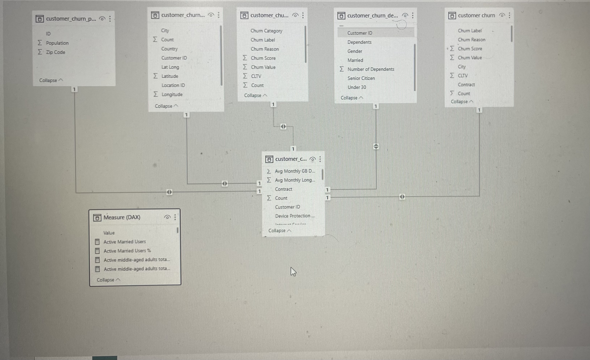

The model is a star schema.
There are 5-dimension tables and 1 fact table. The dimension tabls are all joined to the fact table with a one-to-many relationship.

---

## Data Transformation
- The dataset for this project consists of five different tables: customer_churn_demographics, customer_churn_location, customer_churn_services, customer_churn_status, customer_churn_population). Additionally, I created a calculated table called DAX Measures.
- Before analysis, each table was thoroughly checked for data quality. There was no instances of Null values or white-spaces, and all spellings were in proper cases.
- In the customer_churn_services table, some columns which are (Avg Monthly Long Distance Charges, Monthly Charge, Total Charges, Total Refunds, Total Extra Data Charges, Total Long Distance Charges, Total Revenue) had their datatype stored as Text. To ensure accuracy and consistency, these columns were modified to the appropriate currency data type.
- A calculated column called “Age Category” was created in the customer_churn_demographics table. This column categorises customer based on their age

  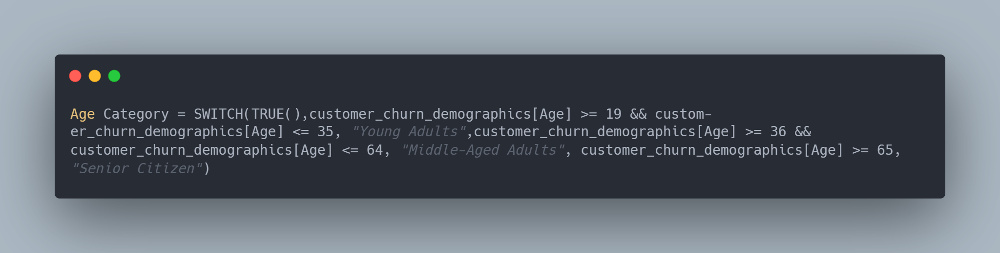

- Several essential DAX measures were created to provide valuable insights

  Active Users DAX                           |                            Active Users DAX
  :-----------------------------------------:|:------------------------------------------:|
  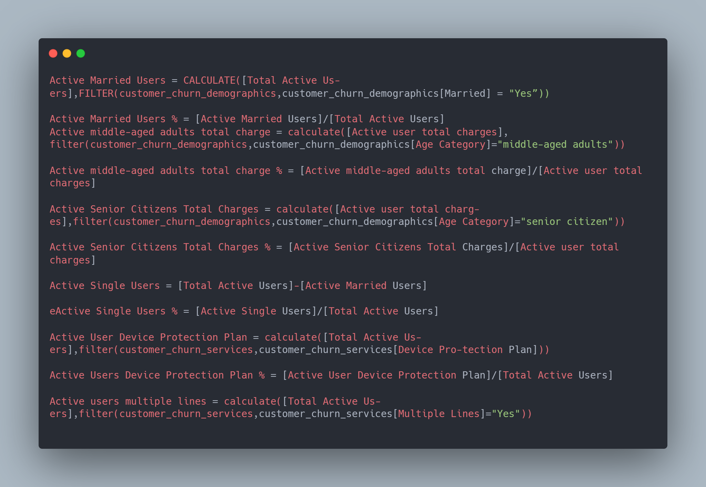                     |                     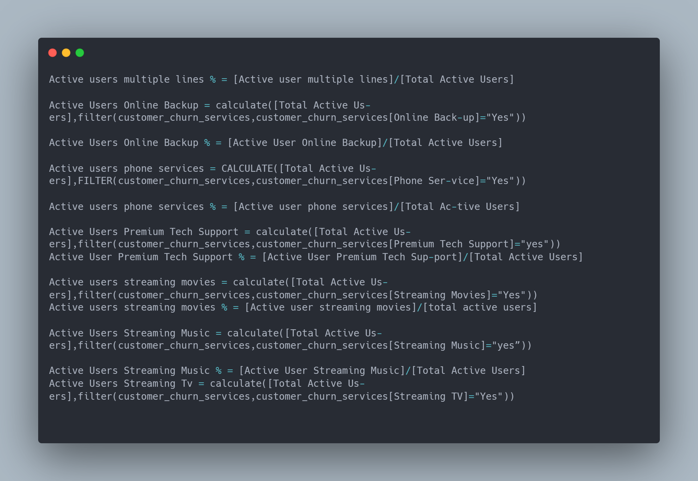

  
  Active Users DAX                           |                            Active Users DAX
  :-----------------------------------------:|:------------------------------------------:|
  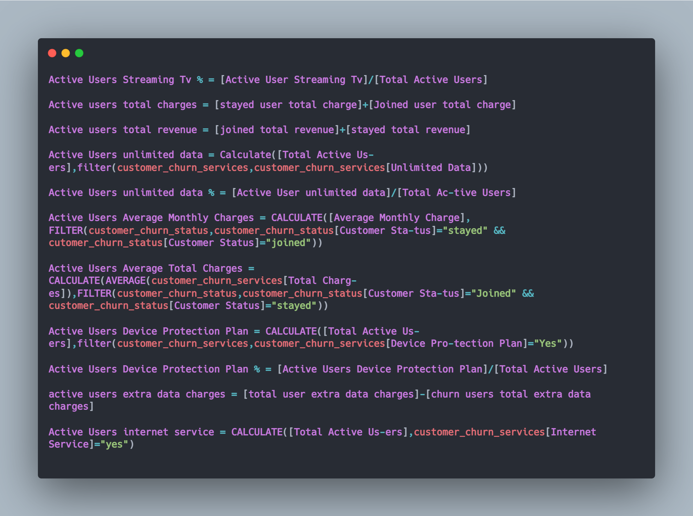                     |                     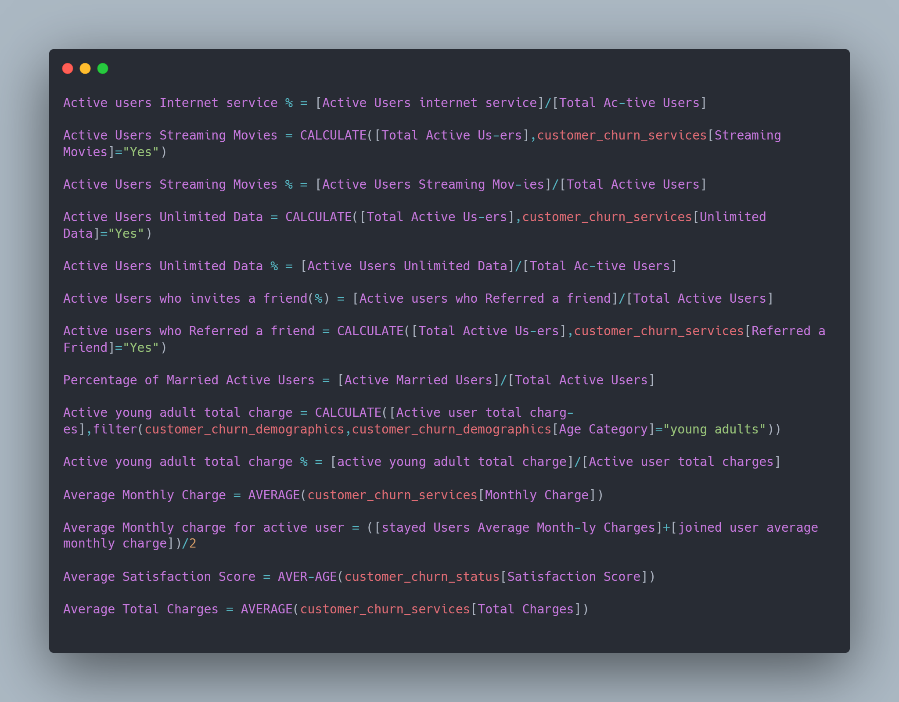

  churn Users DAX                            |                            churn Users DAX
  :-----------------------------------------:|:------------------------------------------:|
  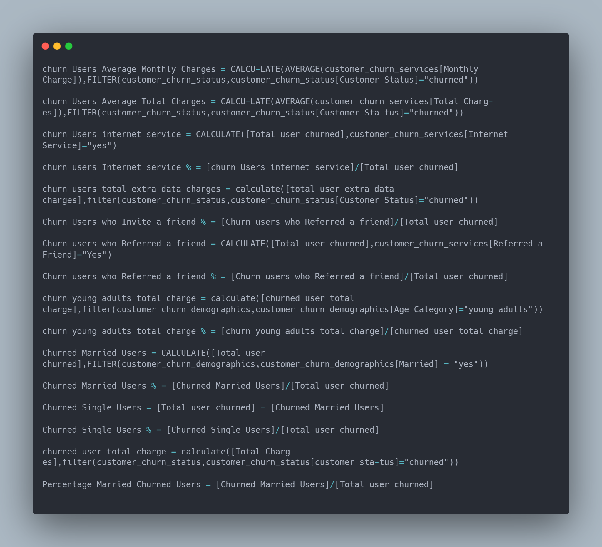                      |                     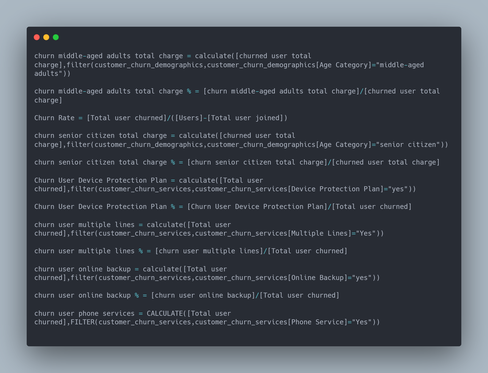

   Users DAX                                 |                                  Users DAX
  :-----------------------------------------:|:------------------------------------------:|
  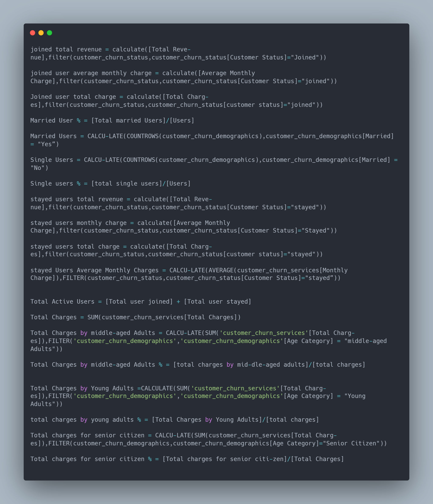                        |                         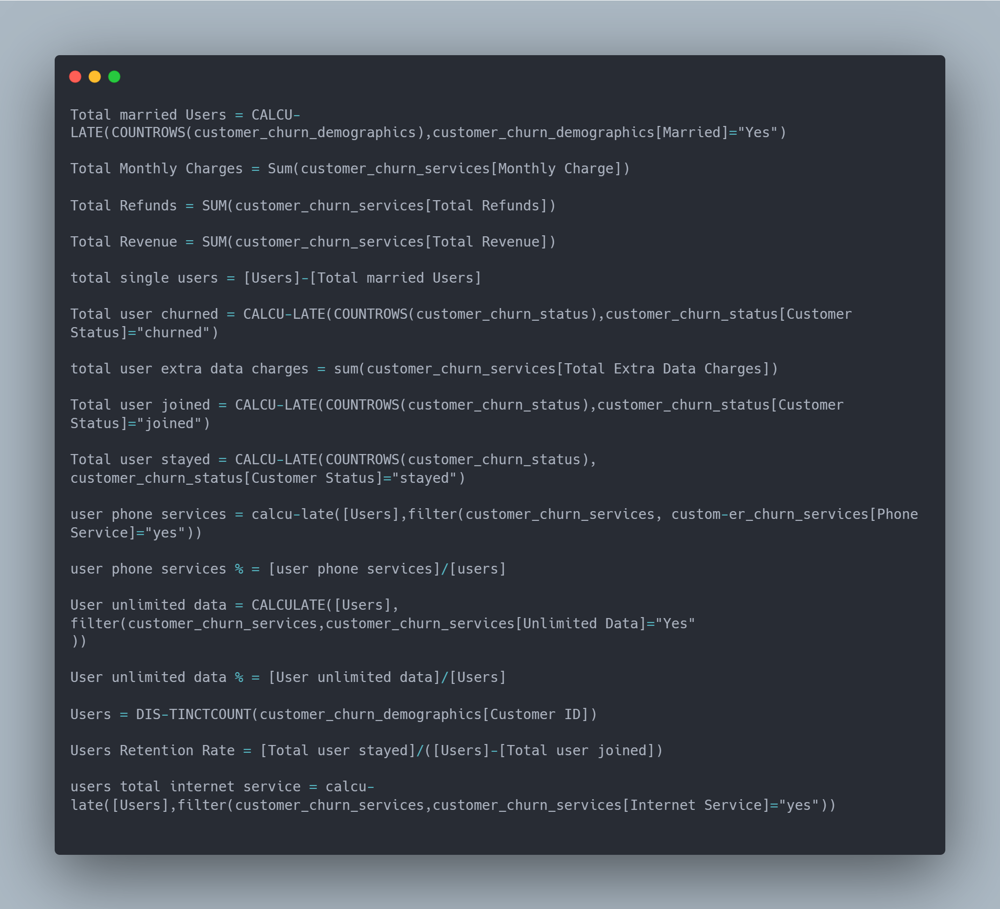

---

## Insights

This project includes three dashboards reports: the Executive Dashboard, Active Users Dashboard, and Churned Users Dashboard. Here are the key insights from the Executive Dashboard:

- The dataset comprises a total of 7043 users, with 5174 (71.63%) classified as active users and 1869 (28.73%) as churned users.
- Among the users, 4000 are males, while 3000 are females. Additionally, 51.70% are single, while 48.30% of the users are married.
- About half of the users fall into the middle-aged adults category(36-64years), with 3732 users. There are 2169 young adults (19-35years) and 1142 senior citizens(65 and above).
- The telecommunication company generated a total revenue of $21.37million over a period of 72months while averaging monthly charge of $64.76
- The major factors driving revenue  are the internet services and the type of contracts subscribers choose. Fibre optics internet service has the highest number of subscribers, with 3000 users, accounting to 43.09% of total user base and generating $12.41 million in revenue. The second most popular internet service is the Digital Subscriber Line (DSL) with 1652 subscribers(23.46%), contributing $4.55 million in revenue. Cable internet service has 830 subscribers (11.87% subscribers) and generated $2.23 million in revenue. Additionally, 1526 users (21.67% subscribers) only subscribe to the phone service.
- Over half of subscribers have choose the month-to-month contract type (3615 users), but this high number does not significantly impact revenue when compared to the one-year contract users (1516 users). However, the 1883 users who are subscribed to the two-year contract plan contribute significantly higher revenue compared to other contract types.
- Los Angeles and San Diego are the top cities with the highest revenue compared to other cities.

  Active Users Insights:

- Month-to-Month: 2,220 active users have chosen this flexible contract type, and 970 of them stayed after the first year. The retention rate remains consistent over the years.
- One Year: 1,307 active users opted for this contract type, and a significant 88% stayed until the end of their one-year contract.
- Two Year: 1647 active users chose this long-term contract, and more that 96% stayed  throughout the first year.

  Satsifaction Score:

  - The average satisfaction score for the active users is 3, with 1,149 users rating it 5, 1,788 rating it 4, and 2,236 rating it 3
The average satisfaction score for active users is 3, with a significant number of users rating it as 4 and 5, indicating a generally positive level of satisfaction among the majority of users.

In conclusion, the report provides insights into the contract preferences, service usage patterns, and satisfaction levels of active users. It highlights that users have options to choose contracts based on their budget and commitment preferences, with Month-to-Month plans offering flexibility but higher monthly charges, while One Year and Two Year plans provide cost savings over time. Furthermore, the data indicates that users tend to utilize additional services more frequently as they opt for longer contract durations. Overall, the majority of active users express a positive level of satisfaction, with many rating it as 4 or 5 out of 5.

Churn Insights:

- Month-to-Month: A significant number of users who chose the month-to-month contract type ended up churning. About 59.87% of the churns occurred within the first 0-12months, with a total of 1037 users churned.
- One Year Contract: Users with a one year contract showed a lower churn rate. Out of the 1550 total users in this, only 166 churned.
- Two Year Contract: Users with a two year contract had lower churn rates. Only 48 out of 1835 total users churned.
In summary, the data highlights that longer contract durations, such as one-year and two-year plans, are associated with significantly lower churn rates. Month-to-month contracts are more prone to churn, likely due to their flexibility and reduced commitment. This information can inform strategic decisions to reduce churn and enhance user retention.

Churned Reasons:

- Month-to-Month Contract: The top reason for churning in this category were competition (45%), attitude of service support (17%), dissatisfaction with services (16%), price (11%), and other reasons not stated (10%)
- One Year Contract: similar reasons were cited in this category, with competition still being the major factor, followed by attitude of support, dissatisfaction, price, and other reasons not stated.
- Two Year Contract: Even though the churn rate was low in this category, competition remained the top reason for churning.
In summary, regardless of contract duration, competition offering customers better offers on various services consistently emerges as the key factor driving churn. This underscores the importance of addressing competitive pressures and enhancing customer satisfaction to reduce attrition across all contract types. Furthermore, improvements in service support, pricing strategies, and overall service quality can contribute to increased customer retention in the telecommunications industry.

Cities with the Highest Churn Cases:

The cities with the highest churn rates were San Jose, San Francisco, Los Angeles, Sacremento, and Long Beach. The major reasons for churning in these cities were “better device offers from com-petitors, better deals from competitors, and more data offerings from competitors.

---

## Recommendations:

- The month-to-month category has the highest churn rate. To reduce churn in this category, the company should consider introducing incentives or discounts for customers who opt for longer term contracts, such as one or two year contracts. This can provide customers with added value and encourage them to commit to the company for a longer duration.
- Competition emerges as a major reason for customer churn across all contract types and cities. It is essential for the company to conduct a thorough competitor analysis to understand the strengths and weakness of rival telecommunication providers. By addressing areas where competitors have an advantage, the company can better position its services and offers to retain existing customers and attract new ones.
- The findings underscore the importance of enhancing the quality of customer support. The company should prioritize investments in bolstering its customer support services, aiming to swiftly and proficiently resolve customer concerns. Establishing a platform for ongoing staff education, particularly in handling customers professionally during high-pressure situations, it is essential to ensure a consistently positive customer service experience. This proactive approach can nurture customer loyalty and effectively mitigate the risk of churn.
- The analysis reveals that internet service offerings heavily influence revenue generation. The company should focus on enhancing its internet services, such as improving connection reliability and offering competitive data packages. This can attract more customers and increase overall revenue.
- The cities with the highest churn rates, including San Jose, San Francisco, Los Angeles, Sacramento, and Long Beach, require special attention. By closely monitoring the churn reason and preferences of customers in these cities, the company can devise location-specific strategies to address pain points and improve customer overall satisfaction.

---

## Visualisation:

This project consists of three dashboards:

- Executive Dashboard:

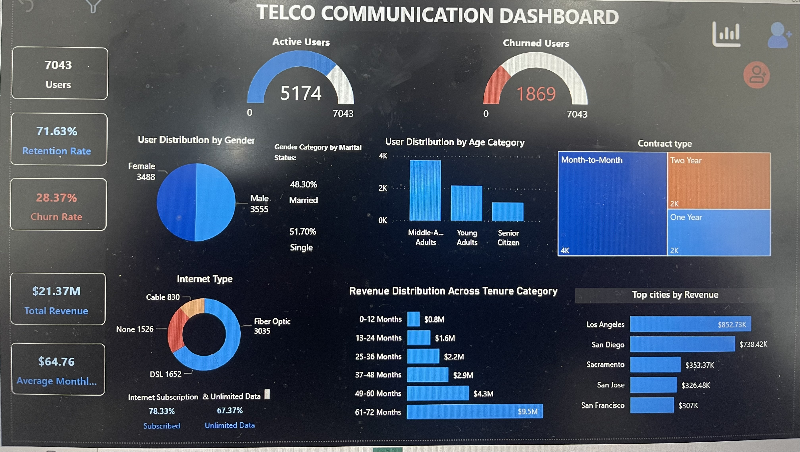

- Active Users Dashboard:

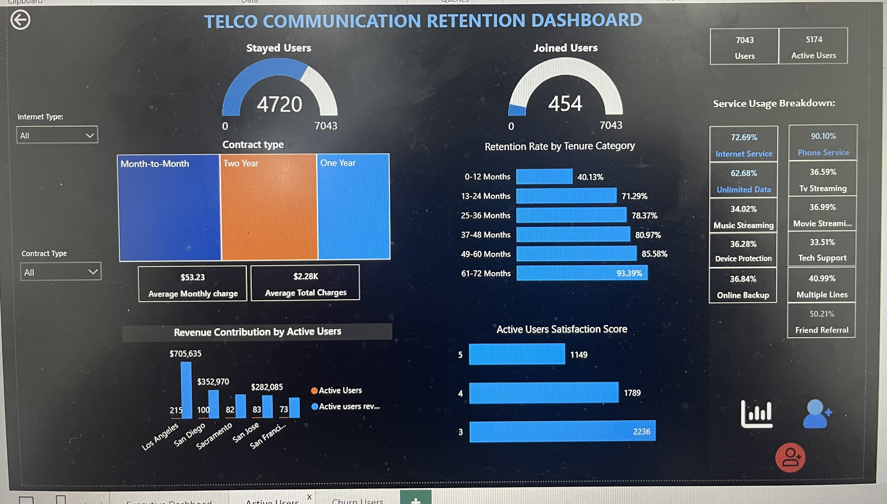

- Churn Users Dashboard:

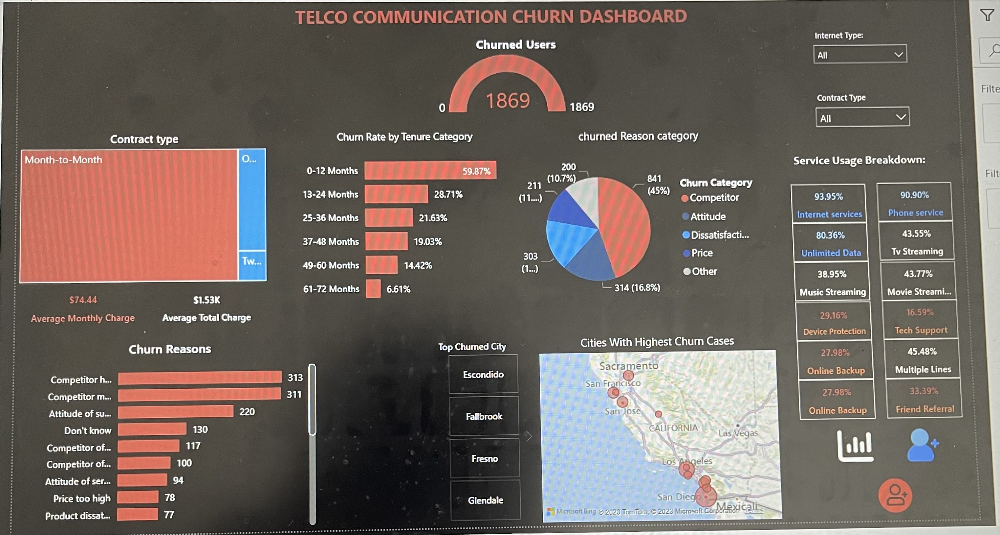

please click [here](https://app.powerbi.com/links/K4L2nYBXIW?ctid=e757cfdd-1f35-4457-af8f-7c9c6b1437e3&pbi_source=linkShare) to interact with dashbaord. 

Thank you!
  

  

